# Studying Data-Oriented Design

In an effort to study the necessary DOD knowledge for this project I watched the [Andrew Kelley's lecture on DOD](https://youtu.be/IroPQ150F6c).

## Capstone: The Wait/Wake Plane
The following capstone exercise was given to me by Claude Opus 4.8 to prove adequate mastery of the concepts:

Design — **data only, prose and tables in your journal, zero code** — the data plane for the part of your kernel that owns threads, their scheduling state, and the objects they block on.

**What the subsystem owns.** Processes (each with ≥1 thread) and threads. Every thread is in exactly one scheduling state: `Running` (per-CPU), `Runnable`, `Blocked-on-object`, `Sleeping-on-timer`, or `Zombie`. Threads block on waitables — `pipes`, counting `semaphores`, and `timers` — one at a time. Userspace names processes by `pid`, threads by `tid`, waitables by an object `handle`, and every handle must tolerate slot reuse: a stale handle is *detected*, never dereferenced.

### The forcing functions (these are where the concepts bite):

1. The scheduler's hot loop — "pick the next runnable thread on this CPU" — must not touch one byte it doesn't need, and must not scan all threads testing a state field. State exactly which columns it reads and how many cache lines per candidate.

2. Waitables are dispatched by tag + switch, not trait objects. One flat object table or one per type is your call — defend it.

3. For each of these flags — has-pending-signal, is-detached, needs-reschedule, fpu-dirty — decide bitset vs in-struct, per flag, by access pattern. (At least one of them arguably should not be out-of-band. Find it.)

4. The whole thing must read as a normalized schema: tables, keys, foreign keys, and no fact stored twice.

### The "prove it" scenarios — show your layout handles each:

- A — Stale handle. Thread X holds handle H to a semaphore. The semaphore is destroyed; its slot is reused by a new pipe. X calls wait(H). Show, from the data layout alone, what makes this return an error instead of blocking on the wrong object. ("We'll check" is not an answer — structure it.)
- B — Wake honesty. A semaphore with 200 blocked threads gets one post. Where do the "blocked on object O" threads live, and does your layout wake exactly one without dragging 200 cold PCBs through cache?
- C — Cold path. ps wants every process's name, pid, parent pid, and cumulative CPU time. Show this works over your SoA with no duplicate AoS table — and say why the column scatter is fine here.
- D — Normalization trap. Every context switch into a new process needs that process's address-space root. Copy it into the TCB (fast, denormalized) or reach it via the process table (one indirection, normalized)? Pick one, defend it against the counter, and name the invalidation bug the copy risks.
- E — The anti-pattern check. Name one field or flag where applying SoA / out-of-band / handles would be wrong, and why.

**Bonus (SMP, Phase 4 preview):** per-CPU runnable sets where two cores selecting threads never touch the same cache line — name the false-sharing hazard and how the split kills it.

---

# My Solution

The order in which I think to approach this problem:
- List all entities and describe their fields and relationships.
- Identify foreign keys.
- Normalization (follow 3NF if relevant).
- Apply DOD concepts as appropriate: Handles / Indices instead of pointers, Structure of Arrays, Existence Based Processing, Out-of-Band Booleans and Encodings.
- Attempt to answer the "prove it" scenarios.

## Entities
Let's first list our entities, it is likely each will have a table of their own - this fits well with the Structure of Arrays pattern, because the column of each table is an array of elements corresponding to a specific struct:

- Process
- Thread
- Waitable

Let's describe each entity.

### Process

- A process `owns` any number of threads, at least one. This means Process has a *one-to-many relationship* with Thread.
- The unique identifier of a Process is its `pid` field - this is the primary key in the Process table.

### Thread

- A thread possibly `owns` a single Waitable, but one Waitable can be shared by multiple threads (or even processes in the case of a semaphore or pipe).
    This means Waitable must have a nullish value, and there is a one-to-many relationship between Thread and Waitable.
- The unique identifier of a Thread is its `tid` field - this is the primary key in the Thread table.
- A thread holds a `state` field that accepts the following values: `Runnable`, `Running`, `Blocked-on-object`, `Sleeping-on-timer`, `Zombie`.

### Waitable

- A waitable is uniquely identified by its `handle` field (primary key in Waitable).
- A waitable has a `type` field that accepts the following values: `pipe`, `semaphore`, `timer` and `none` (in the case the Waitable is nullified).

We may want to seek an alternative to the `none` value of a Waitable. This will allow us later to be more efficient on memory, if we can manifest threads with tightly packed data.

Alternatively, we could just use the `state` field to ascertain whether a Thread has a handle by creating a logical rule:

$$
\text{A thread has a waitable} \iff \text{thread.state} \in \{ \text{Blocked-on-object}, \text{Sleeping-on-timer}\}
$$

Then, convert Waitable into a `WaitableType` HashMap that maps `handle` to a `type`.

The only consideration here is if HashMaps break DOD principles and tightly packed data. If the underlying HashMap is implemented using a tightly packed array,
this might be fine, assuming the probability for a Waitable's type to be needed follows a uniform distribution.

**Note:** It might be tempting to use the Thread field `tid` as a foreign key for Waitable, however Waitables can have multiple owners, so this would not be appropriate.

## Foreign Keys

Given that there is a one-to-many relationship between Process and Thread - one process can own multiple threads - we can see
that we should create a separate table for threads that includes a foreign key that points back to a row in Process.

Here we face an interesting issue: How do we hold an 'array' of Threads for a single Process using SoA?
I'm sure there is a standard DOD way to handle this, but one solution that comes to mind is the following solution:
Add to Process a `threadNum` field representing the number of threads a process owns, and a `threadIdx` field that holds the starting index of the process's thread
in any of the corresponding arrays that hold a Thread field.

Let's say `x` is the field belonging to some Thread owned by a Process.
Now we know that all of the process's threads can be found in a given Thread array starting from index `threadIdx` up to (`threadIdx + threadNum`).
Now we can iterate those to find the value of `x` that we need.

The issue arises when a process drops or gains a thread - how do we maintain a tightly packed array this way?

We will come back to this later. For now, we get the following entity tables:

### Process

Fields: `pid` (primary key), `threadIdx`, `threadNum`.

### Thread

Fields: `tid` (primary key), `pid` (foreign key), `state`, `waitableHandle`.

### Waitable

Fields: `handle`, `type`.

*All `Thread.waitableHandle` values must be valid values from `Waitable.handle`.*

## Normalization

After evaluation, the schema is indeed in 3rd Normal Form (3NF).
This suffices, however notably the schema is also in Boyce-Codd Normal Form (BCNF).

## The Final Schema

Developing the actual finalized schema required looking at both the **Forcing Functions** and the **Prove-it scenarios**, and reiterating
over the schema to update it accordingly. *I'm wondering if there is a better, more systematic way to determine how to convert an abstract set of objects with potential*
*interdependencies into a DOD schema*.

This is the final schema I arrived at after careful planning:

```mermaid
erDiagram
    PROCESS {
        int pid PK
        string name
        int ppid
        int cumulativeCPUTime
        long addressSpaceRoot
    }

    THREAD_TRANSLATOR {
        int tid PK
        int pid FK
        int threadHandle FK
        int threadState
    }

    RUNNING_THREAD {
        int threadHandle PK
        int tid FK
    }

    RUNNABLE_THREAD {
        int threadHandle PK
        int tid FK
    }

    BLOCKED_THREAD {
        int threadHandle PK
        int tid FK
        long waitableHandle "[32-bit index | 32-bit generation]"
    }

    SLEEPING_THREAD {
        int threadHandle PK
        int tid FK
    }

    ZOMBIE_THREAD {
        int threadHandle PK
        int tid FK
    }

    WAITABLE {
        int handle PK
        int internalHandle FK "Index into the appropriate array by type"
        int type "ENUM: 'pipe', 'semaphore', 'timer', 'none'"
        int generation
        int nextWaiting
        int lastWaiting
    }

    WAITING {
        int waitingId PK
        int waitableHandle FK
        int tid FK
        int nextWaiting
    }

    PIPE {
        int handle PK
        int fd
    }

    COUNTING_SEMAPHORE {
        int handle PK
        int count
        int limit
    }

    TIMER {
        int handle PK
        int end_time
    }
```



Note that the Primary Keys in this schema are actually not fields in and of themselves but rather the index of the struct within its own array.

### In Practice

#### Process
- We split the process's values into separate arrays (Structure of Arrays).

#### Thread
- Split into five types of arrays, one for each possible thread state.
- Stored in three distinct arrays (for each thread type): `threadPids`, `threadStates` and `threadWaitables`.
    So for example: `threadPidsRunning`, `threadPidsBlocked`, etc.
- `threadPids` contains the `pid` field of the thread at the given slot.
- `threadStates` hold the the thread's `state` field.
- `threadWaitables` holds the a (`waitableHandle`, `waitableLifetime`) pair in each slot.

##### Thread Translation
Given we move threads between the various arrays as their states change, their indices also get updated.
This means that we must separate between the reference used externally for a thread (the thread ID or `tid` that identifies it) and the actual internal handle used to access the thread across the various states.
Thus a thread with thread ID `tid` is accessed by a combination of `threadHandle` and `threadState`.
This also means that each thread must also hold an Foreign Key `tid` that points back to the Thread Translator, so that the `threadState` can be updated accordingly.
- We hold an additional array `threadHandles` indexed by `tid`.
- We hold an additional array `threadStates` indexed by `tid`.

The reason we store the pair in `threadWaitables` is because we will be necessarily using both for all accesses to a Waitable object.

**We store all of a thread's lifetime-existing data in the Thread Translator.** Only the `waitableHandle` is stored in a separate array, relevant only when the thread is in `Blocking` state.

#### Waitable
- `WaitableTypes` array for `type` field
- `WaitableGeneration` array for `generation` field.
- `internalHandles` array for indexes into the relevant Waitable type array (see below [Waitable: Pipe](#waitable-pipe)). Thus all Waitables are accessed by a `type + internalHandle` pair.
- A Waitable's handle is composed of 64-bit integer containing an index and a generational value.
- `nextWaitings` array for the index in Waiting arrays that points to the thread waiting on this object that should be unblocked next.
- `lastWaitings` array for the indices of the final waiting threads for the waitable objects, to allow for fast addition to the linked list.

Specifically, the most significant 32 bits of the handle will be the index and the least significant 32 bits are the generation.
The reason we need both is to be able to recognize when an object has been swapped (Scenario A).
Firstly, if threads only held an index to the object as the handle, a thread would have no way of knowing if the object had been swapped.
Given that multiple threads can hold the same index into the Waitables array (whether swapped or not), the implication is that the data
that decides if an object has been swapped must belong specifically to the thread.

Initially, I thought we could return both an index and a type to a thread.
This would mean if the thread observed a semaphore and that semaphore was swapped with a pipe, we would know the swapping occurred.
The issue arises when an object is swapped for a new object of the same type.

Thus we create a `generation`. We add an additional integer, that represents the generation of this object.
We hand this generation along with the index to the thread, when it asks to observe the object.
Now, whenever the object is swapped we increment its generation.

Handling `WAIT` calls:
```
WAIT(H): If `WaitableGeneration[H.index] != H.generation`: Return error.
```
Since the handle itself is 64-bits long, this fits perfectly into a register in x86-64, allowing the calculation to be done easily.

#### Waitable: Pipe
- Stored in array `pipes`.
- Each slot in the array hold the value for `pipeFd`, which is the file descriptor processes use when they want to write to the pipe.

#### Waitable: Counting Semaphore
- Holds `count` in `semaphoreCounts` array (indexed by `internalHandle`), which is how many processes are currently holding the semaphore.
- Holds `limit` in `semaphoreLimits` array (similarly indexed), which holds the maximum number of processes that can acquire the semaphore at once.

#### Waitable: Timer
- Stored in `timerEndTimes` array, holds the end times (calculated when the timer is initiated) of the timers

##### Waiting

Since we want the CPU to be able to quickly pick a thread that is waiting on a Waitable object, we offer the following solution:
- When a thread waits on an object, we create a `Waiting` struct for it, containing:
    - The `waitableHandle` for the object it is waiting on.
    - The `tid` of the thread that is waiting (we use `tid` and not the `internalHandle` because it is possible that while the thread is blocked its state changes for some reason.
    In this event, it's state changes and thus the waiting object should not try and return it, but move on to the next waiting thread.
    - The `nextWaiting` handle, pointing to the next waiting object in the linked list that is waiting on this object.

This way, we can keep a tightly packed linked list of all waiting objects, and simply use a linked list that the waitable maintains the nextWaiting to be the first item in the linked list.
We can also add to the linked list quickly by simply setting the nextWaiting index of the current lastWaiting Waiting object, then update the lastWaiting index to be the next index in the
Waiting array.

## Forcing Functions

### 1. Scheduler hot loop

We assume for the sake of the capstone, that `Runnable` threads are selected in FIFO style.
We also assume that the manner of adding a new thread to the Runnable array is by appending it to the end.
So the first Runnable thread is always at index 0.

```
pickRunnable:
    Move tidsRunnable[0].tid => tidsRunning[tidsRunning.length].tid
    Update ThreadTranslator[tid].state = `Running`
```

Thus we read precisely two columns, tid and state.
As for cache lines per thread candidate: because the Runnable array contains only 32-bit integers (the `tid`), and a standard cache line is 64 bytes:
$$
\text{# Cache Lines} = \frac{32}{64 * 8} = 0.0625
$$
We get $0.0625$ cache lines per candidate.

### 2. Dispatching Waitables using `tag + switch`

- We define a Waitable by a tag (the `waitableHandle` which is ultimately an index into an array) **and** a switch (the `waitableType`, which tells us which array to index into).
- The reason for this is to allow us to easily index over multiple waitable objects of the same type, which follows the Existence-Based Processing, and saves us having to represent state explicitly.

### 3. Flags

We have four flags:
- `has-pending-signal` - When flipped on, means a thread has a signal pending that needs to be delivered.
- `is-detached` - Signifies whether the thread in question should run independently of the parent thread / process (`pid`) that created it.
- `needs-reschedule` - Signifies preemption is required for the thread.
- `fpu-dirty` - Signifies the FPU (Floating Point Unit) has been used during this thread's current execution and should therefore be stored as well during a context switch.

#### Placement Decisions

|Flag|Location|Reason|
|---|---|---|
|has-pending-signal|In Struct|We want fast, easy access to this flag, as signals are intrusive to a thread's execution. This means we may want to check this flag every time the thread is handled, and therefore we want it to arrive in the cache line as well along with the rest of the thread data.|
|is-detached|Bitset|Knowing if a thread is detached or not is usually rarely needed, apart from when it exits, perhaps. Because it is rarely needed, we do not need to pull it into the cache very often, and it is more efficient to only call for it when we know it is needed.|
|needs-reschedule|Bitset|For core synchronization, we don't want the core updating the preemption flag to affect the struct that is in the hottest line of another core's cache. This would cost us hundreds of cycles by invalidating the other core's cache line, and forcing it to read from RAM. Therefore, we change the bit in a universal bitset, and have the other core simply check the bit the next time it is safe to do so.|
|fpu-dirty|In Struct|If we retained this in a bitset, the cores would easily contain the bits of threads being run by other cores, in their same cache line. This would make cores constantly invalidate each other's cache lines the moment their thread executes some floating-point calculations, resulting in massive RAM overhead from cache line invalidations.|

### 4. Normalized Schema

As mentioned above, the schema is normalized and no fact is repeated.
We only have unique identifiers (Primary Keys) and references where necessary (Foreign Keys). No object holds the same data twice.

### Bonus: SMP
To synchronize cores when it comes to Runnable threads, we could split the Runnable array specifically, into N Runnable arrays, where N is the number of cores:
Runnable_Core0, Runnable_Core1, ..., Runnable_CoreN.
Then we deterministically assign a thread to a Runnable array by finding the cores with minimal Runnable processors in their queues.
Then we take the core with the lowest ID of those cores, and append the thread's `tid` to that array.
This means the cores always access threads from disjoint sets, preventing race conditions or sync issues.

## Justification - The "Prove It" Scenarios
- There are no padded bytes in any array, and all arrays are tightly packed.
- We have implemented Hot / Cold for the waitable handle in thread, as these are always used together.
- As for the processes not having their own array: Given we are building a CPU scheduler with the ability to quickly pick the next thread to run,
    we prioritize splitting threads by `state` value to facilitate this, over keeping processes that can track their various threads.
    Instead, we maintain threads of the same process via a shared `pid`. This matches the concept that commands like `ps` are infrequent and therefore we would be willing to make this tradeoff.

### A. Stale Handle

As explained above, when an object is swapped its generation is incremented (for completeness, we will also state that the incrementation is wraparound from 0 to maximum 32-bit integer value).
This means that if thread `X` tried to call `WAIT(H)` with the stale handle, its old generation is checked against the updated generation in the Waitable object, raising an error because the generations don't match.

### B. Wake honesty

We utilize a tightly packed, flattened linked list for this purpose, containing Waiting objects across all Waitables.
The Waitable holds the index in the linked list to the next Waiting object that should be unblocked when possible.
This means on unblocking (such as sending `post` to a semaphore), the Waitable checks one specific index, unblocks the thread associated with it and replaces the nextWaiting variable with the next Waiting object
in the relevant linked list.

Thus unblocking happens in `O(1)` time.

### C. Cold Path
In this case, we would iterate through each of the arrays in the SoA for Process, printing out entire processes, one at a time into a neat table, for the `ps` command.

The reason the column scatter is fine here, is because we expect `ps` to be a command executed relatively rarely, and so we are okay with trading off efficiency in executing the `ps` command specifically,
which we do not perform often, in exchange for a more optimized performance over most other operations, that generally involve a specific process or thread.


### D. Normalization Trap

We split the addressSpaceRoot into its own array of addressSpaceRoots, indexed by the `pid`.
We place a `pid` foreign key in the thread's local information as well, so we can easily access it along with the thread when we copy the thread data into the cache.
This allows us to index into the addressSpaceRoots array and find the address of the beginning of the process in memory.

The reason we prefer this rather than placing the addressSpaceRoot field directly into the Process struct, is because Process struct is meant to be massive, containing a lot of data about the
process that we often don't need, especially not for context switching and loading the thread.
This way, we prevent loading in massive amounts of memory into the cache, and prevent cache misses unnecessarily - by embracing the Structure-of-Arrays pattern.

An alternative I considered: Placing the addressSpaceRoot directly into the thread's information.
This would cause a massive desync issue the moment the actual address space root address changed, as we would need to update every thread in the process.
If the update fails to do so for every thread, we would undoubtedly end up with a kernel panic and page faults.
